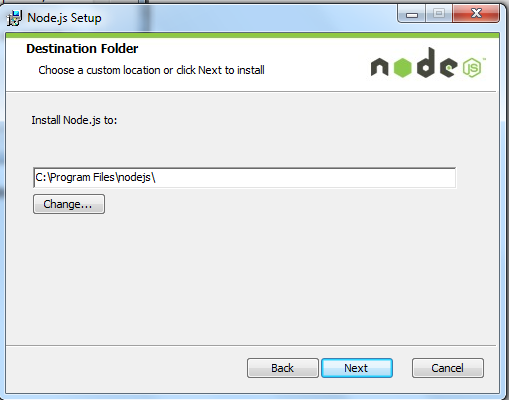
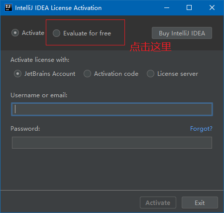

易途网站教程文档
===


# 目录

* [环境准备](#环境准备)
	* [nodejs安装](#nodejs安装)
	* [IntelliJ IDEA安装](#IntelliJ IDEA安装)
* [无环境启动](#无环境启动)
* [编译安装](#编译安装)
* [主要使用组件](#主要使用组件)
	* [vuetify](#vuetify)
	* [echarts](#echarts)
	* [axios](#axios)
	* [vuex](#vuex)
	* [router](#router)
	* [vuescroll](#vuescroll)
	* [vue-video-player](#vue-video-player)
	* [vue-photo-preview](#vue-photo-preview)
* [非组件技术点](#非组件技术点)
	
## 环境准备
拿到源码后需要配置启动环境<br>
nodejs 用于Node.js是一个事件驱动I/O服务端JavaScript环境<br>
IntelliJ IDEA 开发环境`墙裂推荐`使用IDEA方便之后的后台开发,还可以使用`VS Code`,`HBuilder X`等
### nodejs安装
[nodejs下载地址](http://nodejs.cn/download/)<br>
Windows 上安装 Node.js<br>
<br>
步骤 1 : 双击下载后的安装包如下所示：<br>
<br>
步骤 2 : 点击以上的Run(运行)，将出现如下界面：<br>
<br>
步骤 3 : 勾选接受协议选项，点击 next（下一步） 按钮 :<br>
<br>
步骤 4 : Node.js默认安装目录为 "C:\Program Files\nodejs\" , 你可以修改目录，并点击 next（下一步）：<br>
<br>
步骤 5 : 点击树形图标来选择你需要的安装模式 , 然后点击下一步 next（下一步）<br>
<br>
步骤 6 :点击 Install（安装） 开始安装Node.js。你也可以点击 Back（返回）来修改先前的配置。 然后并点击 next（下一步）：<br>
<br>
安装过程：<br>
<br>
点击 Finish（完成）按钮退出安装向导。<br>
<br>
检测PATH环境变量是否配置了Node.js，点击开始=》运行=》输入"cmd" => 输入命令"path"，输出如下结果：
```
PATH=C:\oraclexe\app\oracle\product\10.2.0\server\bin;C:\Windows\system32;
C:\Windows;C:\Windows\System32\Wbem;C:\Windows\System32\WindowsPowerShell\v1.0\;
c:\python32\python;C:\MinGW\bin;C:\Program Files\GTK2-Runtime\lib;
C:\Program Files\MySQL\MySQL Server 5.5\bin;C:\Program Files\nodejs\;
C:\Users\rg\AppData\Roaming\npm
```
我们可以看到环境变量中已经包含了C:\Program Files\nodejs\ 至此node环境已经安装完成
### IntelliJ IDEA安装
[IntelliJ IDEA下载地址](https://www.jetbrains.com/idea/download/#section=windows)<br>
Windows 上安装 IntelliJ IDEA<br>
<br>
<br>
步骤 1 : 双击下载后的安装包如下所示：<br>
<br>
步骤 2 : 点击以上的Next(下一步)，将出现如下界面：<br>
<br>
步骤 3 : 你可以修改目录，并点击 next（下一步）：<br>
<br>
步骤 4 : 可以选择创建桌面图标,配置关联文件等,并点击 next（下一步）：<br>
<br>
步骤 5 : 点击Install 开始安装<br>
<br>
安装过程：<br>
<br>
点击 Finish（完成）按钮退出安装向导。<br>
打开安装完成后的IDEA<br>
<br>
是否导入配置，我选择的是不导入<br>
后面请一路next直到激活界面，选择试用<br>
<br>
<br>
## 无环境启动
方式一:直接打开线上网站进行观看[链接](http://vue.etoak.com/)<br>
方式二:启动下载目录中的nginx-1.16.1<br>
进入目录按住Shift 点击鼠标右键<br>
<br>
选择`在此处打开 Powershell 窗口`打开命令行窗口 输入start nginx<回车>启动nginx 如下:<br>
<br>
在浏览器中直接访问[http://localhost:8090](http://localhost:8090)<br>
输入.\nginx.exe -s stop 停止nginx 如下:<br>
<br>
## 编译安装
如已安装好环境请继续,如未安装好请看[环境准备](#环境准备)<br>
进入下载文件中的et目录按住Shift 点击鼠标右键<br>
<br>
选择`在此处打开 Powershell 窗口`打开命令行窗口 输入npm install<回车> 如下:<br>
<br>
安装完成后会在et目录下生成node_modules目录<br>
直接启动: 在Powershell窗口中直接输入npm run dev <回车> <br>
<br>
在浏览器中直接访问[http://localhost:8090](http://localhost:8090)<br>
在IDEA中启动:<br>
<br>
选择et目录<br>
<br>
<br>
<br>
配置node路径<br>
<br>
<br>
启动完成后在浏览器中直接访问[http://localhost:8090](http://localhost:8090)<br>
## 主要使用技术
当前工程使用的是vue2.5.2版本使用了很多组件和部分样式<br>
### vuetify
`vuetify` 是 Vue.js 的头号组件库，自 2016 年以来一直在积极开发。该项目的目标是为用户提供使用 Material Design specification 构建丰富且引人入胜的 web 应用程序所需的一切。它通过一致的更新周期、对以前版本的长期支持 (LTS)、响应式社区参与、丰富的资源生态系统和对高质量组件的贡献来实现这一点。<br>
### echarts
`echarts` 一个使用 JavaScript 实现的开源可视化库，可以流畅的运行在 PC 和移动设备上，兼容当前绝大部分浏览器（IE8/9/10/11，Chrome，Firefox，Safari等），底层依赖矢量图形库 ZRender，提供直观，交互丰富，可高度个性化定制的数据可视化图表。<br>
### axios
`axios` Axios 是一个基于 promise 的 HTTP 库，可以用在浏览器和 node.js 中。<br>
### vuex
`vuex` Vuex 是一个专为 Vue.js 应用程序开发的状态管理模式。它采用集中式存储管理应用的所有组件的状态，并以相应的规则保证状态以一种可预测的方式发生变化。Vuex 也集成到 Vue 的官方调试工具 devtools extension，提供了诸如零配置的 time-travel 调试、状态快照导入导出等高级调试功能。<br>
### router
`router` Vue Router 是 Vue.js 官方的路由管理器。它和 Vue.js 的核心深度集成，让构建单页面应用变得易如反掌。<br>
### vuescroll
`vuescroll` vuescroll 是一款基于 Vue.js 自定义滚动条的插件，它有两种模式:<br>
	native: 适用于 PC 端， 支持基本的自定义滚动条。
	slide: 适用于移动端， 支持下拉-加载，上拉刷新，轮播等。
但是，这并不意味着 slide 模式只能用于移动端，只是因为移动端与 slide 模式更加契合而已。<br>
### vue-video-player
`vue-video-player` 适用于 Vue 的 video.js 播放器组件。Video.js 是一个为HTML5世界而构建的网络视频播放器。它支持HTML5和Flash视频，以及YouTube和Vimeo（通过插件）。<br>
### vue-photo-preview
`vue-photo-preview` vue-photo-preview是基于photoswipe的vue图片预览插件