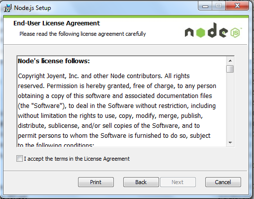
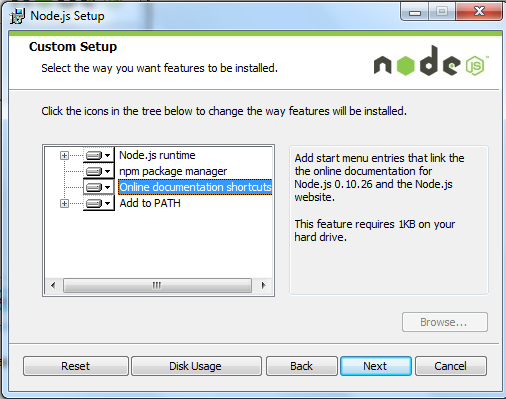
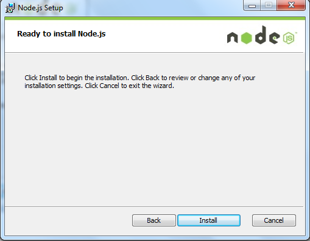
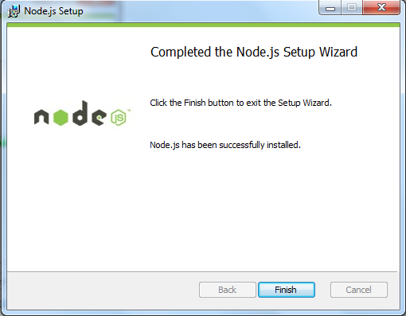

易途网站教程文档
===


# 目录

* [环境准备](#环境准备)
	* [nodejs安装](#nodejs安装)
* [无环境启动](#无环境启动)
* [编译安装](#编译安装)
* [主要使用组件](#主要使用组件)
	* [vuetify](#vuetify)
	* [echarts](#echarts)
	* [axios](#axios)
	* [vuex](#vuex)
	* [router](#router)
	* [vuescroll](#vuescroll)
	* [vue-video-player](#vue-video-player)
	* [vue-photo-preview](#vue-photo-preview)
* [非组件技术点](#非组件技术点)
	
## 环境准备
拿到源码后需要配置启动环境<br>
nodejs 用于Node.js是一个事件驱动I/O服务端JavaScript环境
### nodejs安装
[nodejs下载地址](http://nodejs.cn/download/)<br>
Windows 上安装 Node.js<br>

步骤 1 : 双击下载后的安装包如下所示：

步骤 2 : 点击以上的Run(运行)，将出现如下界面：

步骤 3 : 勾选接受协议选项，点击 next（下一步） 按钮 :

步骤 4 : Node.js默认安装目录为 "C:\Program Files\nodejs\" , 你可以修改目录，并点击 next（下一步）：

步骤 5 : 点击树形图标来选择你需要的安装模式 , 然后点击下一步 next（下一步）

步骤 6 :点击 Install（安装） 开始安装Node.js。你也可以点击 Back（返回）来修改先前的配置。 然后并点击 next（下一步）：

安装过程：

点击 Finish（完成）按钮退出安装向导。

检测PATH环境变量是否配置了Node.js，点击开始=》运行=》输入"cmd" => 输入命令"path"，输出如下结果：
```
PATH=C:\oraclexe\app\oracle\product\10.2.0\server\bin;C:\Windows\system32;
C:\Windows;C:\Windows\System32\Wbem;C:\Windows\System32\WindowsPowerShell\v1.0\;
c:\python32\python;C:\MinGW\bin;C:\Program Files\GTK2-Runtime\lib;
C:\Program Files\MySQL\MySQL Server 5.5\bin;C:\Program Files\nodejs\;
C:\Users\rg\AppData\Roaming\npm
```
我们可以看到环境变量中已经包含了C:\Program Files\nodejs\ 至此node环境已经安装完成
## 编译安装

## 主要使用技术
