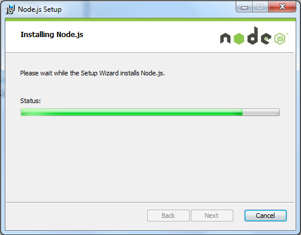
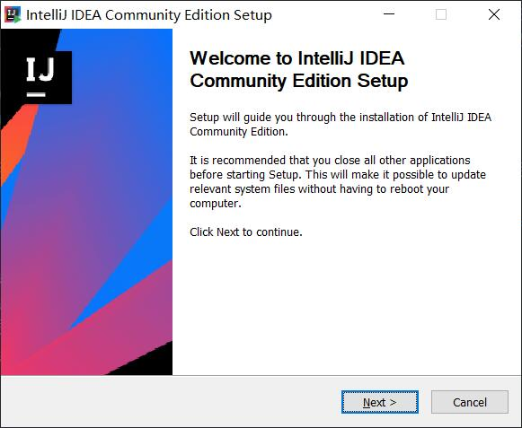

易途网站教程文档
===

# 目录

* [环境准备](#环境准备)
	* [nodejs安装](#nodejs安装)
	* [IntelliJ IDEA安装](#IntelliJ IDEA安装)
* [无环境启动](#无环境启动)
* [编译安装](#编译安装)
* [主要使用组件](#主要使用组件)
	* [vuetify](#vuetify)
		* [Grids(栅格)](#Grids栅格)
		* [Sheets(延展纸)](#Sheets延展纸)
		* [Parallax(视差)](#Parallax视差)
	* [echarts](#echarts)
	* [axios](#axios)
	* [vuex](#vuex)
	* [router](#router)
	* [vuescroll](#vuescroll)
	* [vue-video-player](#vue-video-player)
	* [vue-photo-preview](#vue-photo-preview)
* [非组件技术点](#非组件技术点)
	
## 环境准备
拿到源码后需要配置启动环境<br>
nodejs 用于Node.js是一个事件驱动I/O服务端JavaScript环境<br>
IntelliJ IDEA 开发环境`墙裂推荐`使用IDEA方便之后的后台开发,还可以使用`VS Code`,`HBuilder X`等
### nodejs安装
[nodejs下载地址](http://nodejs.cn/download/)<br>
Windows 上安装 Node.js<br>
<br>
步骤 1 : 双击下载后的安装包如下所示：<br>
<br>
步骤 2 : 点击以上的Run(运行)，将出现如下界面：<br>
<br>
步骤 3 : 勾选接受协议选项，点击 next（下一步） 按钮 :<br>
<br>
步骤 4 : Node.js默认安装目录为 "C:\Program Files\nodejs\" , 你可以修改目录，并点击 next（下一步）：<br>
<br>
步骤 5 : 点击树形图标来选择你需要的安装模式 , 然后点击下一步 next（下一步）<br>
<br>
步骤 6 :点击 Install（安装） 开始安装Node.js。你也可以点击 Back（返回）来修改先前的配置。 然后并点击 next（下一步）：<br>
<br>
安装过程：<br>
<br>
点击 Finish（完成）按钮退出安装向导。<br>
<br>
检测PATH环境变量是否配置了Node.js，点击开始=》运行=》输入"cmd" => 输入命令"path"，输出如下结果：
```
PATH=C:\oraclexe\app\oracle\product\10.2.0\server\bin;C:\Windows\system32;
C:\Windows;C:\Windows\System32\Wbem;C:\Windows\System32\WindowsPowerShell\v1.0\;
c:\python32\python;C:\MinGW\bin;C:\Program Files\GTK2-Runtime\lib;
C:\Program Files\MySQL\MySQL Server 5.5\bin;C:\Program Files\nodejs\;
C:\Users\rg\AppData\Roaming\npm
```
我们可以看到环境变量中已经包含了C:\Program Files\nodejs\ 至此node环境已经安装完成
### IntelliJ IDEA安装
[IntelliJ IDEA下载地址](https://www.jetbrains.com/idea/download/#section=windows)<br>
Windows 上安装 IntelliJ IDEA<br>
<br>
<br>
步骤 1 : 双击下载后的安装包如下所示：<br>
<br>
步骤 2 : 点击以上的Next(下一步)，将出现如下界面：<br>
<br>
步骤 3 : 你可以修改目录，并点击 next（下一步）：<br>
<br>
步骤 4 : 可以选择创建桌面图标,配置关联文件等,并点击 next（下一步）：<br>
<br>
步骤 5 : 点击Install 开始安装<br>
<br>
安装过程：<br>
<br>
点击 Finish（完成）按钮退出安装向导。<br>
打开安装完成后的IDEA<br>
<br>
是否导入配置，我选择的是不导入<br>
后面请一路next直到激活界面，选择试用<br>
<br>
<br>
## 无环境启动
方式一:直接打开线上网站进行观看[链接](http://vue.etoak.com/)<br>
方式二:启动下载目录中的nginx-1.16.1<br>
进入目录按住Shift 点击鼠标右键<br>
<br>
选择`在此处打开 Powershell 窗口`打开命令行窗口 输入start nginx<回车>启动nginx 如下:<br>
<br>
在浏览器中直接访问[http://localhost:8090](http://localhost:8090)<br>
输入.\nginx.exe -s stop 停止nginx 如下:<br>
<br>
## 编译安装
如已安装好环境请继续,如未安装好请看[环境准备](#环境准备)<br>
进入下载文件中的et目录按住Shift 点击鼠标右键<br>
<br>
选择`在此处打开 Powershell 窗口`打开命令行窗口 输入npm install<回车> 如下:<br>
<br>
安装完成后会在et目录下生成node_modules目录<br>
直接启动: 在Powershell窗口中直接输入npm run dev <回车> <br>
<br>
在浏览器中直接访问[http://localhost:8090](http://localhost:8090)<br>
在IDEA中启动:<br>
<br>
选择et目录<br>
<br>
<br>
<br>
配置node路径<br>
<br>
<br>
启动完成后在浏览器中直接访问[http://localhost:8090](http://localhost:8090)<br>
## 主要使用技术
当前工程使用的是vue2.5.2版本使用了很多组件和部分样式<br>
### vuetify
`vuetify` 是 Vue.js 的头号组件库，自 2016 年以来一直在积极开发。该项目的目标是为用户提供使用 Material Design specification 构建丰富且引人入胜的 web 应用程序所需的一切。它通过一致的更新周期、对以前版本的长期支持 (LTS)、响应式社区参与、丰富的资源生态系统和对高质量组件的贡献来实现这一点。<br>
#### Grids(栅格)
Vuetify 附带了一个使用 flex-box 构建的 12 点栅格系统。 网格用于在应用程序的内容中创建特定布局。其中包含 5 种媒体断点，分别用于定位特定屏幕大小或方向：xs, sm, md, lg 和 xl。 这些分辨率在下面的视口断点表中定义，可以通过自定义 Breakpoint service 进行修改。<br>
系统中大量使用了栅格进行系统的排本以适应多端系统如下代码片段:<br>
``` html
<v-col class="pa-4" cols="12" md="5">
	<v-sheet color="grey darken-3 pa-5">
	  <v-row>
		<v-col cols="12" style="height: 204px;">
		  <et-charts :option="flotDashboardChart"></et-charts>
		</v-col>
	  </v-row>
	  <v-row>
		<v-col cols="12" md="6">
		  <span class="title d-flex justify-center">￥6321</span>
		  <span class="subtitle-2 d-flex justify-center">业内平均薪资</span>
		</v-col>
		<v-col cols="12" md="6">
		  <span class="title d-flex justify-center">￥12481</span>
		  <span class="subtitle-2 d-flex justify-center">易途外包薪资</span>
		</v-col>
	  </v-row>
	</v-sheet>
</v-col>
```
```
v-row 代表行分割
v-col 代表列分割
一行可以分割为12列 可以进行嵌套分割
```
效果如下:<br>
<br>
#### Sheets(延展纸)
v-sheet 旨在为 Vuetify 中的其他 paper 组件提供支持。 它旨在用作低级组件。<br>
``` html
<v-sheet color="grey darken-3 pa-5">
  <h1 class="title">最新合作项目</h1>
  <p class="subtitle-2 font-weight-light">包括外包技术服务和独立研发项目:</p>
  <div class="adminpro-message-list">
	<ul class="message-list-menu">
	  <li v-for="item in desserts"><span :class="dessertsClass(item.num)">{{item.num}}</span> <span class="message-info">{{item.message}}</span>
		<span class="message-time">{{item.time}}</span>
	  </li>
	</ul>
  </div>
</v-sheet>
```
效果如下:<br>
<br>
#### Parallax(视差)
v-parallax 组件创建一个 3d 效果使图像显示比窗口滚动更慢。<br>
``` html
<section id="stats">
  <!-- src="https://images.unsplash.com/photo-1510915228340-29c85a43dcfe?ixlib=rb-1.2.1&ixid=eyJhcHBfaWQiOjEyMDd9&auto=format&fit=crop&w=1950&q=80" -->
  <v-parallax :height="$vuetify.breakpoint.smAndDown ? 700 : 500" src="https://images.unsplash.com/photo-1510915228340-29c85a43dcfe?ixlib=rb-1.2.1&ixid=eyJhcHBfaWQiOjEyMDd9&auto=format&fit=crop&w=1950&q=80">
	<v-container fill-height>
	  <v-row class="mx-auto">
		<v-col v-for="[value, title] of stats" :key="title" cols="12" md="3">
		  <div class="text-center">
			<div class="display-3 font-weight-black mb-4" v-text="value"></div>
			<div class="title font-weight-regular text-uppercase" v-text="title"></div>
		  </div>
		</v-col>
	  </v-row>
	</v-container>
  </v-parallax>
</section>
```
效果请看`关于我们`页面
#### Hover(悬停)
v-hover 组件为任何组件处理悬停状态提供了一个干净的接口。
``` vue
<template xmlns:v-slot="http://www.w3.org/1999/XSL/Transform">
  <v-responsive class="overflow-y-auto" :max-height="$store.state.maxHeight">
  <v-container>
    <v-row class="fill-height" align="center" justify="center">
      <template v-for="(item, i) in items">
        <v-col
          :key="i"
          cols="12"
          md="6"
          sm="12"
          dark
        >
          <v-hover v-slot:default="{ hover }" dark>
            <v-card
              class="mx-auto"
              max-width="600"
              style="width:90vw;"
              dark
            >
              <v-img
                :aspect-ratio="12/8"
                :contain="true"
                :src="item.img"
              >
                <v-expand-transition>
                  <div
                    v-if="hover && !$vuetify.breakpoint.xs"
                    class="d-flex transition-fast-in-fast-out orange darken-2 v-card--reveal display-3 white--text"
                    style="height: 100%;"
                  >
                    {{ item.category.replace("—","") }}
                  </div>
                  <div
                    v-if="hover && $vuetify.breakpoint.xs"
                    class="d-flex transition-fast-in-fast-out orange darken-2 v-card--reveal display-3 white--text"
                    style="height: 100%;font-size:2em !important;"
                  >
                    {{ item.category.replace("—","") }}
                  </div>
                </v-expand-transition>
              </v-img>
              <v-card-text
                class="pt-6"
                style="position: relative;padding-left:0px;padding-right:0px;"
              >
                <v-btn
                  absolute
                  color="orange"
                  class="white--text"
                  fab
                  large
                  right
                  top
                >
                  <v-icon>mdi-import</v-icon>
                </v-btn>
                <div class="font-weight-light grey--text title mb-2">{{ item.name }}</div>
                <h3 class="display-1 font-weight-light orange--text mb-2">{{ item.category }}</h3>
                <div class="font-weight-light title mb-2">
                  {{ item.desc }}
                </div>
                <v-bottom-navigation
                >
                  <v-btn
                    v-for="n in 6"
                    :key="n"
                    min-width="5vw"
                    style="padding-right:0px;padding-left:0px;"
                    >
                    <span>{{ item.compose[n-1] }}</span>
                    <v-icon  color="red">{{ item.icons[n-1] }}</v-icon>
                  </v-btn>
                </v-bottom-navigation>
              </v-card-text>
            </v-card>
          </v-hover>
        </v-col>
      </template>
    </v-row>
    <v-divider></v-divider>

  </v-container>
</v-responsive>
</template>
<style>
  .v-card--reveal {
    align-items: center;
    bottom: 0;
    justify-content: center;
    opacity: .5;
    position: absolute;
    width: 100%;
  }
</style>
<script>
  export default {
    data () {
      return {
        clientWidth:document.documentElement.clientWidth,
        items: [
          {
            name: '汪老师',
            category: "—易途COREJAVA讲师",
            desc: '人气颇高的美女讲师，授课严谨细致、脉络清晰，讲解声情并茂，善于拓展延伸，亲和力强，对待教学认真负责，要求严格，循循善诱，平易近人，不厌其烦，细心讲解，经验丰富，深入浅出，逻辑性强，善于总结归纳重点和难点。负责Java核心技术的教学，是无数易途学员的启蒙老师。',
            img: '../../../static/teacher/wl.png',
            compose:['JVM构成','核心语法','数据类型','运算符','面向对象','设计模式'],
            icons: ['mdi-home-search-outline','mdi-tag-heart','mdi-format-list-bulleted-type','mdi-plus','mdi-account-supervisor','mdi-grease-pencil'],
          },
          {
            name: '薄老师',
            category: '—易途数据库讲师',
            desc: '四年开发经验，曾在胜利油田项目中负责数据库迁移，并在中国移动旗下咪咕阅读参与数据库方案设计，数据实时推送，还在建筑，金融，电商，智能警务等多个行业积累了Oracle丰富的实战经验，并将整个课程都与现实工作紧密结合起来，负责Oracle数据库教学。',
            img: '../../../static/teacher/bqp.png',
            compose:['Oracle','MySQL','XML','JDBC','DBCP','连接池实现'],
            icons: ['mdi-moon-new','mdi-size-m','mdi-close-thick','mdi-lan-connect','mdi-database-import','mdi-database'],
          },
          {
            name: '张老师',
            category: '—J2EE核心技术讲师',
            desc: '六年开发经验，精通JQUERY/AJAX/XHTML等WEB前端技术，精通ICBCCTP等大型框架，曾任职上海工商银行科技部技术总监，后转向JAVA教学，兼任多家网络技术公司研发顾问。授课有着迷人的魅力，在讲解知识中，总会有出其不意的精彩亮点，深受广大学员的喜爱。 负责J2EE核心技术的教学',
            img: '../../../static/teacher/zwc.png',
            compose:['Servlet','JSP','HTML','Javascript','AJAX','JQuery'],
            icons: ['mdi-alpha-s-circle','mdi-alpha-j','mdi-language-html5','mdi-language-javascript','mdi-elevator-up','mdi-jquery'],
          },
          {
            name: '周老师',
            category: '—易途持久层框架讲师',
            desc: '八年开发经验，五年教学经验，精通UNIX/LINUX，擅长持久层深挖掘，华东地区著名MYBITIS课程专家，曾任多个企业项目组技术总监，后于2010年专注于JAVA教学。专业功底深厚，讲解精辟透彻，善于启迪学生思路，剖析底层框架架构，思路非常清晰。负责持久层框架以及表现层框架技术的教学',
            img: '../../../static/teacher/zk.png',
            compose:['Hibernate','MyBatis','IBatis','Struts','持久层缓存','框架原理'],
            icons: ['mdi-hulu','mdi-size-m','mdi-alpha-i','mdi-numeric-5-circle-outline','mdi-content-duplicate','mdi-electron-framework'],
          },
          {
            name: '卢老师',
            category: '—易途Spring框架讲师',
            desc: '企业级培训专家，曾任职中国联通系统集成分公司，负责内部商城的开发和维护工作。精通系统中设计建模，部署运行，监管和分析管理，精通Spring框架底层逻辑，精通SpringBoot、SpringCloud微服务和分布式平台技术。',
            img: '../../../static/teacher/lxl.png',
            compose:['Spring MVC','Spring','Web Service','Quartz','项目整合','微服务'],
            icons: ['mdi-code-string','mdi-size-s','mdi-recycle-variant','mdi-clock-in','mdi-arrange-bring-forward','mdi-weather-cloudy'],
          },
        ],
        length: 3,
        window: 0,
        showArrows: false,
        vertical: false,
        reverse: false,
        autorun: false,
      }
    },
    created () {
      
      setInterval(() => {
        if (!this.autorun) return
        if (++this.window >= this.length) this.window = 0
      }, 2000)
    },
  }
</script>
```
### echarts
`echarts` 一个使用 JavaScript 实现的开源可视化库，可以流畅的运行在 PC 和移动设备上，兼容当前绝大部分浏览器（IE8/9/10/11，Chrome，Firefox，Safari等），底层依赖矢量图形库 ZRender，提供直观，交互丰富，可高度个性化定制的数据可视化图表。<br>
### axios
`axios` Axios 是一个基于 promise 的 HTTP 库，可以用在浏览器和 node.js 中。<br>
### vuex
`vuex` Vuex 是一个专为 Vue.js 应用程序开发的状态管理模式。它采用集中式存储管理应用的所有组件的状态，并以相应的规则保证状态以一种可预测的方式发生变化。Vuex 也集成到 Vue 的官方调试工具 devtools extension，提供了诸如零配置的 time-travel 调试、状态快照导入导出等高级调试功能。<br>
### router
`router` Vue Router 是 Vue.js 官方的路由管理器。它和 Vue.js 的核心深度集成，让构建单页面应用变得易如反掌。<br>
### vuescroll
`vuescroll` vuescroll 是一款基于 Vue.js 自定义滚动条的插件，它有两种模式:<br>
* native: 适用于 PC 端， 支持基本的自定义滚动条。
* slide: 适用于移动端， 支持下拉-加载，上拉刷新，轮播等。<br>
但是，这并不意味着 slide 模式只能用于移动端，只是因为移动端与 slide 模式更加契合而已。<br>
### vue-video-player
`vue-video-player` 适用于 Vue 的 video.js 播放器组件。Video.js 是一个为HTML5世界而构建的网络视频播放器。它支持HTML5和Flash视频，以及YouTube和Vimeo（通过插件）。<br>
### vue-photo-preview
`vue-photo-preview` vue-photo-preview是基于photoswipe的vue图片预览插件<br>